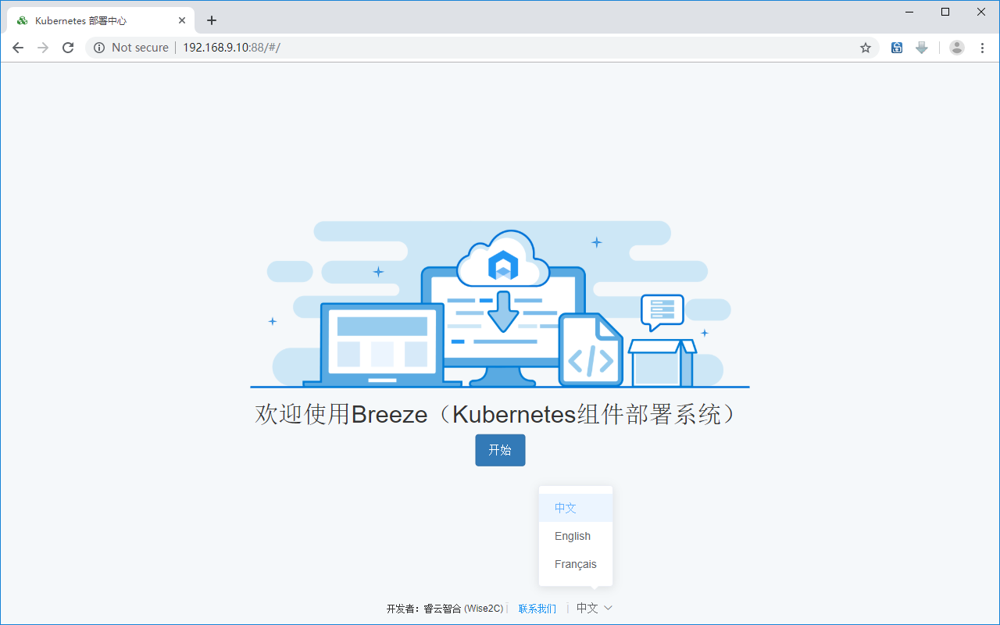
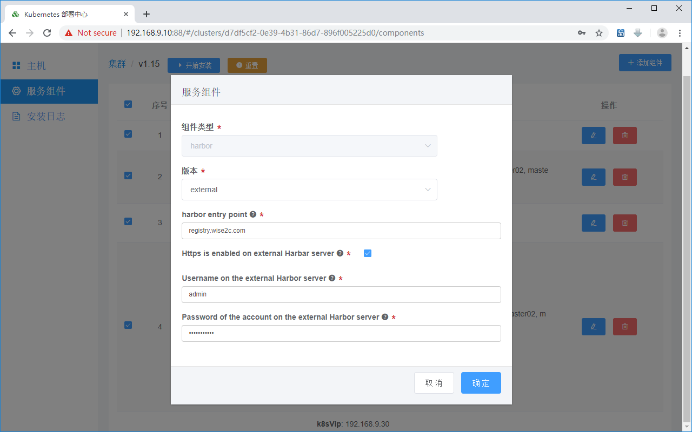
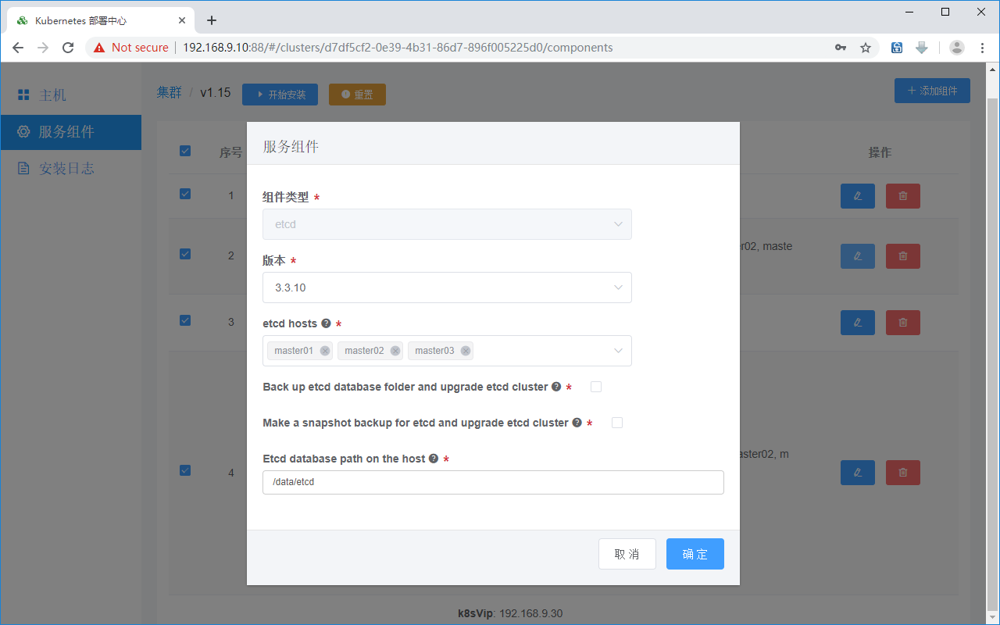

欢迎使用睿云智合提供的图形化Kubernetes部署工具Breeze

使用该工具，将抹平普通用户学习复杂的kubeadm部署技能学习曲线，体会到一键式部署Kubernetes集群的乐趣！

适用操作系统：

RHEL/CentOS: 7.4/7.5/7.6/7.7/7.8/7.9

RHEL/CentOS/RockyLinux/AlmaLinux/OracleLinux: 8.4+

Ubuntu 18/20 LTS

**所有社区用户请注意：**	

凡是2020年以前发布的Breeze版本( https://github.com/wise2c-devops/breeze/releases )，由于kubeadm生成的kubeconfig文件（admin.conf, controller-manager.conf, kubelet.conf, scheduler.conf)内嵌了1年期的证书，请参考[常见排错说明](./TroubleShooting-CN.md)中的第13点来将内嵌证书替换为长期证书。

Note:
1. **请不要把Breeze所在的部署主机加入部署集群主机列表**
2. **为了避免包冲突，请使用纯净的CentOS Minimal安装出来的OS或未经升级过的Ubuntu来部署集群**
3. **对于最小化安装的Ubuntu系统，默认python版本为3，没有安装python2，因此需要对所有Ubuntu被部署节点执行一条命令：**
```
ln -s /usr/bin/python3 /usr/bin/python
```
4. **PrometheusOperator + Kube-Prometheus项目为选装项，需要该功能的中国区用户请务必先对每台被部署机节点设置正确的时区，可参照以下命令：**
```
timedatectl set-timezone Asia/Shanghai
```

在生产环境部署的朋友请注意！！！
1. **当前版本的CA证书是动态生成的，有效期为100年，其它服务证书有效期为50年。**
2. **本安装方式通过了Kubernetes Conformance一致性认证，因此可用于生产环境。**

安装过程演示视频在此：
https://pan.baidu.com/s/1X0ZYt48wfYNrSrH7vvEKiw

常见排错说明在此：
https://github.com/wise2c-devops/breeze/blob/master/TroubleShooting-CN.md

**PDF手册请在此处下载：**

https://github.com/wise2c-devops/breeze/raw/master/manual/BreezeManual-CN.pdf

**大家搜索关注微信公众号【Wise2C】后回复【进群】，睿云小助手会第一时间把拉你进入【 Docker/K8S企业落地实践群】，关于Breeze部署工具的问题以及建议我们在群里讨论！**

操作步骤如下：

1. 软件的使用非常简单，只需要选择相应的Release Tag并下载其中的docker-compose.yml文件：

  （Tags列出的版本号a.b.c.d其中前三位a.b.c对应于Kubernetes的发行版本号，第四位只是Breeze自身部署功能所做的修订，不涉及对Kubernetes的任何修改）


确保您的Linux主机已经安装好了docker以及docker-compose，具体步骤参考以下内容。

（1）对部署机取消SELINUX设定及放开防火墙

```
setenforce 0
sed --follow-symlinks -i "s/SELINUX=enforcing/SELINUX=disabled/g" /etc/selinux/config
firewall-cmd --set-default-zone=trusted
firewall-cmd --complete-reload
```

（2）安装docker-compose命令

```
curl -L https://github.com/docker/compose/releases/download/v2.14.1/docker-compose-$(uname -s)-$(uname -m) -o /usr/local/bin/docker-compose
```

或从镜像站点下载：

```
curl -L http://mirror.azure.cn/docker-toolbox/linux/compose/v2.14.1/docker-compose-$(uname -s)-$(uname -m) -o /usr/local/bin/docker-compose
```

然后设置权限：

```
chmod +x /usr/local/bin/docker-compose
```

(3) 安装docker-io 1.13.1

```
yum install docker
systemctl start docker
systemctl enable docker
```

(4) 下载用于部署某个Kubernetes版本的docker-compose文件并使部署程序运行起来，例如：

```
curl -L https://raw.githubusercontent.com/wise2c-devops/breeze/v1.26.4/docker-compose.yml -o docker-compose.yml
curl -L https://raw.githubusercontent.com/wise2c-devops/breeze/v1.26.4/docker-compose-centos.yml -o docker-compose.yml
curl -L https://raw.githubusercontent.com/wise2c-devops/breeze/v1.26.4/docker-compose-ubuntu.yml -o docker-compose.yml
```

国内用户可以使用阿里云镜像站点文件，部署所用的image将从阿里云拉取：

```
curl -L https://raw.githubusercontent.com/wise2c-devops/breeze/v1.26.4/docker-compose-aliyun.yml -o docker-compose.yml
curl -L https://raw.githubusercontent.com/wise2c-devops/breeze/v1.26.4/docker-compose-centos-aliyun.yml -o docker-compose.yml
curl -L https://raw.githubusercontent.com/wise2c-devops/breeze/v1.26.4/docker-compose-ubuntu-aliyun.yml -o docker-compose.yml
```

然后：

```
docker-compose up -d
```

如果机器磁盘性能较差，需要调整超时，请用以下命令启动：

```
COMPOSE_HTTP_TIMEOUT=300 docker-compose up -d
```

上述文件docker-compose.yml支持混合部署，docker-compose-centos.yml支持单纯CentOS部署，docker-compose-ubuntu.yml支持单纯Ubuntu部署。

如果一切正常（注意deploy-playbook这个容器是个卷容器，它是退出状态这是正常现象），部署机的88端口将能够被正常访问。

2. 在部署机上做好对集群内其它所有服务器的ssh免密登录，命令为：

   (1) 生成秘钥 ssh-keygen -t rsa
   
   (2) 针对目标服务器做ssh免密登录
   
       ssh-copy-id 192.168.9.11
       
       ssh-copy-id 192.168.9.12
       
       ssh-copy-id 192.168.9.13

       ssh-copy-id 192.168.9.20

       ssh-copy-id 192.168.9.21
       
       ...

3. 打开浏览器，访问部署程序的图形界面，添加主机列表、添加服务角色并将加入的主机进行角色分配，然后开始部署，注意页面下方可以切换中、英、法等语言显示：



点击 + 号添加一个集群：


点击“添加主机”，输入主机名、主机IP、描述信息（主机用途），点击确定。

重复该步骤直至将集群所需的全部节点服务器加入：

（k8s master服务器、k8s worker node服务器、harbor服务器等等）：


点击“下一步”再点击“添加组件”按钮，对每个组件进行设置和分配服务器：

（docker角色、harbor角色、loadbalance角色、etcd角色、kubernetes角色、prometheus角色、istio角色）


如果希望Breeze部署程序使用界面里输入的主机名代替当前服务器的主机名，则勾选format host name选项框：


镜像仓库设置这里如果选择某个版本，那么Breeze会自动部署非https的Harbor，如果在版本里选择external，那么Breeze则不再部署Harbor而是和现有Harbor做对接。

参数harbor entry point是指用户端访问镜像仓库的URL，可以直接写IP地址或写对应的域名；如果对接外部的Harbor，请注意勾选外部Harbor是以http访问还是以https访问的：





接下来是设置高可用组件（haproxy+keepalived）：

vip for k8s master是指三个k8s master服务器的高可用虚拟浮动IP地址；网卡请填写实际操作系统下的网卡名，注意请保证3个节点网卡名一致；router id和virtual router id请确保不同k8s集群使用不同的值。


Etcd可以选择部署于K8S Master节点也可以选择独立的三台主机，Back up etcd database folder and upgrade etcd cluster 和 Make a snapshot backup for etcd and upgrade etcd cluster 这两个选项是用于升级环节的，在升级Etcd集群前做备份，默认新装集群不要勾选这两项：




Kubernetes entry point是指高可用的一个设定值，如果生产环境有硬件或软件负载均衡指向这里的k8s master所有节点，那么就可以在这里填写负载均衡的统一入口地址。

相对于昂贵的F5专业硬件设备，我们也可以使用HAProxy和Keepalived的组合轻松完成这个设置，Breeze自带这个组合模块的部署。

例如下图的 192.168.9.30:6444 就是k8s集群高可用的统一入口，k8s的worker node会使用这个地址访问API Server。请注意如果使用的是Breeze自带的高可用组件haproxy+keepalived，则请填写实际的虚IP与默认端口6444。

Just add new worker nodes, do not reinstall this cluster 这个选项是用于向现有集群添加计算节点（Worker Nodes），Upgrade existing cluster 和 Upgrade K8s nodes automatically 选项用于升级现有集群而不是新装集群，而在生产环境升级集群一般采用对节点逐步进行，Breeze只负责将需要升级的镜像及脚本发到工作节点，应由管理员手动执行，并在执行过程中观察业务应用的高可用不受影响，如果勾选了 Upgrade K8s nodes automatically 这这一切会全自动进行，如果所有业务都是有多副本分布在不同计算节点，那么这不会影响业务服务，否则不推荐使用这种方式进行集群在线升级。

关于升级的详情，请参考本项目视频演示。

Kubernetes的界面里还有CNI模型供选择，请按实际需求选择部署Flannel、Calico还是Canal，至于Calico又分为IPIP隧道模式和BGP路由模式，还需要注意集群规模，详情请参考Calico官方网站文档解释。

对于网络地址范围CIDR参数共有三个，分别是Pod、Service、和ClusterIP的地址范围定义，默认值即可正常工作，除非它与你实际网络分配相冲突，才需要手动修改后进行部署。


接下来是可选安装项Prometheus（基于Prometheus Operator方式部署，集成Prometheus、Alertmanager、Grafana），这里请择一台Worker节点进行部署即可，有三个服务暴露端口可自行设定，注意NodePort端口号大于30000。


所有角色定义完成如下：


可选安装项Istio（内置了Kiali图形化管理工具、Jaeger分布式追踪、Prometheus+Grafana对Istio的监控）也是一样的方法，但是请注意Breeze采用了基于Helm的安装方法，因此请选择一台Master节点进行Istio的部署（只有Master节点上安装了helm命令）。有四个服务暴露端口可自行设定，注意NodePort的要求端口号大于30000。


所有角色定义完成如下：


点击“下一步”开始安装部署：


如果界面上所有角色图标全部变为绿色，则表示部署任务结束。可以登录任一k8s节点运行命令 kubectl get nodes 查看结果。


以上例子是3台etcd、3台k8s master、3台k8s worker node、1台镜像仓库的环境。实际可以增减规模。

Kubernetes Dashboard的访问入口我们采用了NodePort:30300的方式暴露端口，因此可以通过火狐浏览器访问 https://任意服务器IP:30300 来登录Dashboard页面，注意其它浏览器例如Chrome因为不接受自签名证书会拒绝访问请求。

新版本Dashboard引入了验证模式，可以通过以下命令获取admin-user的访问令牌：

```
kubectl -n kube-system describe secret $(kubectl -n kube-system get secret | grep admin-user | awk '{print $1}')
```

将返回的token字串粘贴至登录窗口即可实现登录。


安装好Prometheus之后，可以访问以下服务页面：

Grafana：

http://任意服务器IP:30902


Prometheus：

http://任意服务器IP:30900


Alertmanager：

http://任意服务器IP:30903


安装好Istio之后，可以访问以下服务页面：

Kiali：

http://任意服务器IP:30201/kiali

新版本Kiali引入了验证模式，Breeze默认使用与Kubernetes Dashboard相同的token方式，可以通过以下命令获取admin-user的访问令牌：

```
kubectl -n kube-system describe secret $(kubectl -n kube-system get secret | grep admin-user | awk '{print $1}')
```

将返回的token字串粘贴至登录窗口即可实现登录。


Jaeger：

http://任意服务器IP:30280


Prometheus for Istio:

http://任意服务器IP:30290


Grafana for Istio:

http://任意服务器IP:30292


查看集群相关状态：


**如何在已经部署的集群内添加新的Worker Nodes?**

* (1) 在Breeze界面添加主机（设定主机名、IP地址、备注）。

* (2) 在Breeze界面编辑Kubernetes角色，将新主机加入到kubernetes worker nodes列表并勾选"Just add new worker nodes, do not reinstall this cluster"。


* (3) 在Breeze界面仅仅勾选Docker和Kubernetes并开始部署。


