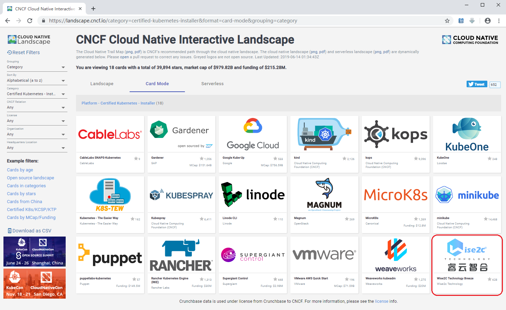
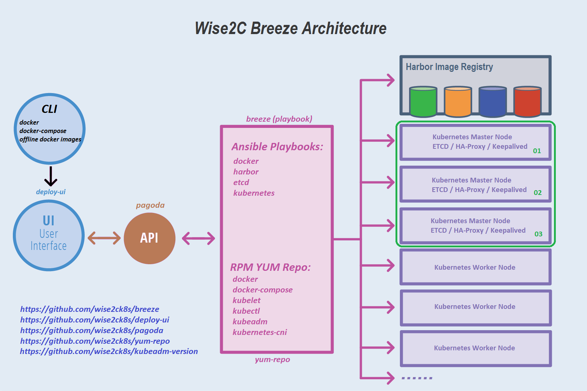

# Breeze
- 可用于生产环境的图形化Kubernetes集群部署工具

[English](./README.md) | [中文](./README-CN.md)

**敬请留意**: 分支代码可能正处于开发状态而不稳定。请选择 [releases](https://github.com/wise2c-devops/breeze/releases) 用于正式环境的部署。

请阅读 **[部署指南](./BreezeManual-CN.md)** 获得更详细的Breeze使用操作指引。

Breeze项目旨在提供一个可信的、安全的、稳定的Kubernetes集群部署工具，它可以帮助您通过图形化操作界面快捷地在生产环境部署一个或多个Kubernetes集群，而不需要连入互联网环境。作为云原生产品安装工具，Breeze被列入[CNCF Cloud Native Interactive Landscape](https://landscape.cncf.io/category=certified-kubernetes-installer&format=card-mode&selected=wise2-c-technology-breeze)，其品质值得信赖。

## 功能
* **运行简单**: Breeze将部署Kubernetes集群所需的全部资源文件打包在一个docker镜像内，这包括Kubernetes的组件镜像、docker、etcd、harbor、kubernetes集群部署的ansible playbook脚本文件等。同时，Breeze部署主机自身也作为一个yum仓库服务器角色存在，因此，您只需准备一台安装了docker和docker-compose命令的主机即可轻松的使Breeze运行起来并进行Kubernetes集群的部署。

* **简化Kubernetes集群部署流程**: 仅需几条简单命令，就能使Breeze程序运行起来，接下来的Kubernetes集群部署工作全都通过图形化操作界面完成。

* **支持离线部署**: 在仅有的4个镜像(playbook, yum-repo, pagoda, deploy-ui) 被加载在Breeze部署主机之后，所有操作都不需要互联网的访问。Breeze自身作为yum仓库对被部署机提供yum源服务并使用kubeadm进行Kubernetes的部署工作，同时Breeze还会部署一个Harbor服务器用于内网的镜像下载服务。

* **支持多个集群批量部署**: Breeze支持批量部署多个Kubernetes集群。

* **支持高可用架构**:  使用Breeze部署的Kubernetes集群，默认提供3个master节点和3个etcd节点, 结合haproxy+keepalived架构服务，所有工作节点都使用虚拟浮动IP地址和主节点服务器通信。

## 架构原理图

## 组件
- **breeze**: 用于部署docker, harbor, haproxy+keepalived, etcd, kubernetes等组件的Ansible playbook。 

- **yum-repo**: 用于安装docker, docker-compose, kubelet, kubectl, kubeadm, kubernetes-cni等的yum仓库源。 

- **deploy-ui**: 图形界面组件。

- **pagoda**: 提供操作Ansible playbook的API。

- **kubeadm-version**: 获取Kubernetes组件版本清单，采用命令"kubeadm config"

## 安装 & 运行

**系统要求:**

**部署机:** docker 1.13.1+ and docker-compose 1.12.0+ .

**Kubernetes集群节点:** 兼容CentOS 7.4/7.5/7.6 及 Ubuntu 16/18 版本，Minimal安装模式是推荐的方式，为了确保部署的顺利进行，应尽可能保证系统的干净。

请阅读 **[部署指南](./BreezeManual-CN.md)** 获得更详细的Breeze使用操作指引。

## 问题反馈沟通

* **微信:** 关注微信公众号【Wise2C】后回复【进群】，睿云小助手会第一时间把拉你进入【 K8s企业落地实践群】，关于Breeze部署工具的问题以及建议我们在群里讨论！

常见排错说明在此：
https://github.com/wise2c-devops/breeze/blob/master/TroubleShooting-CN.md

## 开源许可

Breeze开源项目遵循 [Apache 2 license](LICENSE) 细节。
