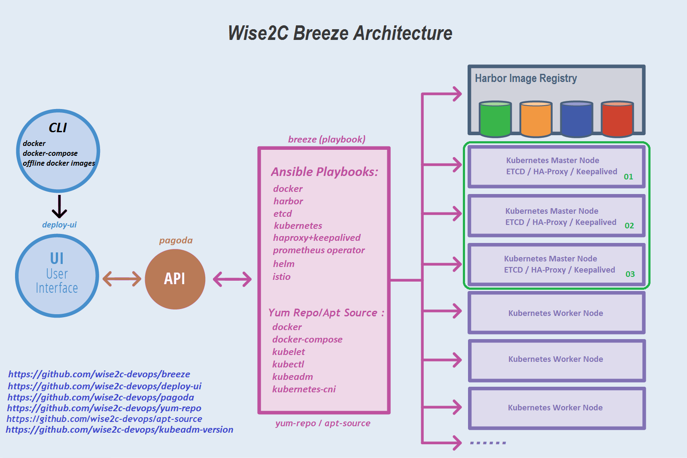

# Breeze
- Deploy a Production Ready Kubernetes Cluster with graphical interface

[English](./README.md) | [中文](./README-CN.md)

**Note**: Branches may be in an *unstable or even broken state* during development.
Please use [releases](https://github.com/wise2c-devops/breeze/releases) instead of those branches in order to get stable binaries.

Refer to **[User Guide](manual/BreezeManual.pdf)** for more details on how to use Breeze.

Project Breeze is an open source trusted solution allow you to create Kubernetes clusters on your internal, secure, cloud network with graphical user interface. As a cloud native installer project, Breeze is listed in [CNCF Cloud Native Interactive Landscape](https://landscape.cncf.io/category=certified-kubernetes-installer&format=card-mode&selected=wise2-c-technology-breeze).

## Features
* **Easy to run**: Breeze combines all resources you need such as kubernetes components images, ansible playbooks for the deployment of kubernetes clusters into a single docker image (wise2c/playbook). It also works as a local yum repository server. You just need a linux server with docker and docker-compose installed to run Breeze.

* **Simplified the process of kubernetes clusters deployment**: With a few simple commands, you can get Breeze running, and then finish all the other deployment processes by the graphical interface.

* **Support offline deployment**: After 4 images (playbook, yum-repo, pagoda, deploy-ui) have been loaded on the deploy server, kubernetes clusters can be setup without internet access. Breeze works as a yum repository server and deploys a local Harbor registry and uses kubeadm to setup kubernetes clusters. All docker images will be pulled from the local Harbor registry. 

* **Support multi-cluster**: Breeze supports multiple kubernetes clusters deployment.

* **Support high available architecture**:  With Breeze, you can setup kubernetes clusters with 3 master servers and 3 etcd servers combined with haproxy and keepalived. All worker nodes will use the virtual floating ip address to communicate with the master servers.

## Architecture

## Components
- **breeze**: Ansible playbook for deployments of docker, harbor, haproxy+keepalived, etcd, kubernetes.

- **yum-repo**: RHEL/CentOS yum repository for docker, docker-compose, kubelet, kubectl, kubeadm, kubernetes-cni etc,. 

- **apt-source**: Ubuntu apt source repository for docker, docker-compose, kubelet, kubectl, kubeadm, kubernetes-cni etc,. 

- **deploy-ui**: Graphical user interface.

- **pagoda**: Server offers the API to operate Ansible playbooks.

- **kubeadm-version**: Get k8s components images version list by command "kubeadm config"

## Install & Run

**System requirements:**

**Deploy server:** docker 1.13.1+ and docker-compose 1.12.0+ .

**Kubernetes cluster server:** CentOS 7.4/7.5/7.6 or Ubuntu 16/18 is required and minimal installation mode is recommended. 

Refer to **[User Guide](manual/BreezeManual.pdf)** for more details on how to use Breeze.

## Community

* **Slack:** Join Breeze's community for discussion and ask questions: [Breeze Slack](https://wise2c-breeze.slack.com/), channel: #general

## License

Breeze is available under the [Apache 2 license](LICENSE).
